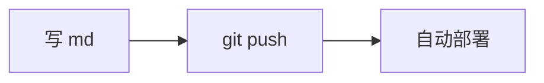
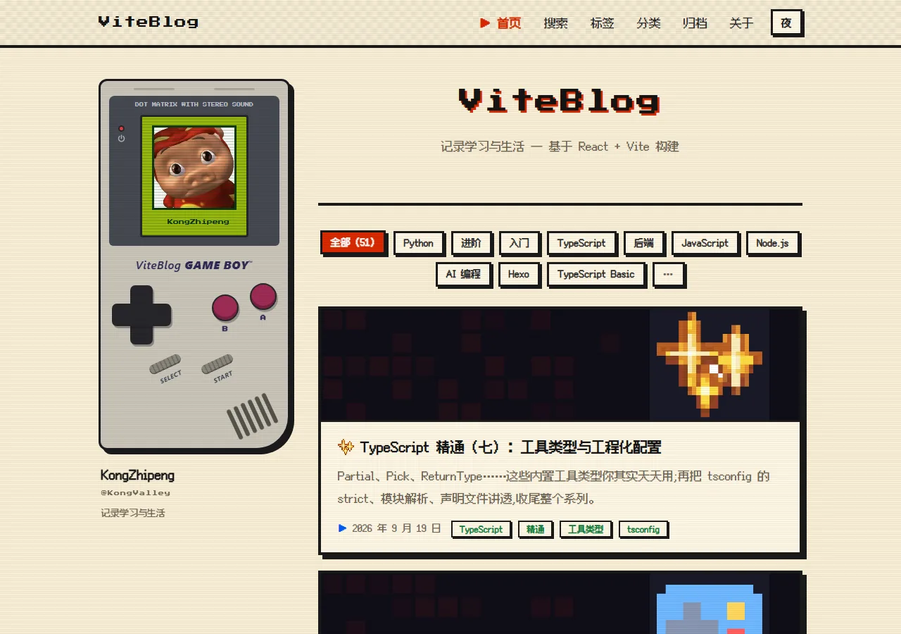
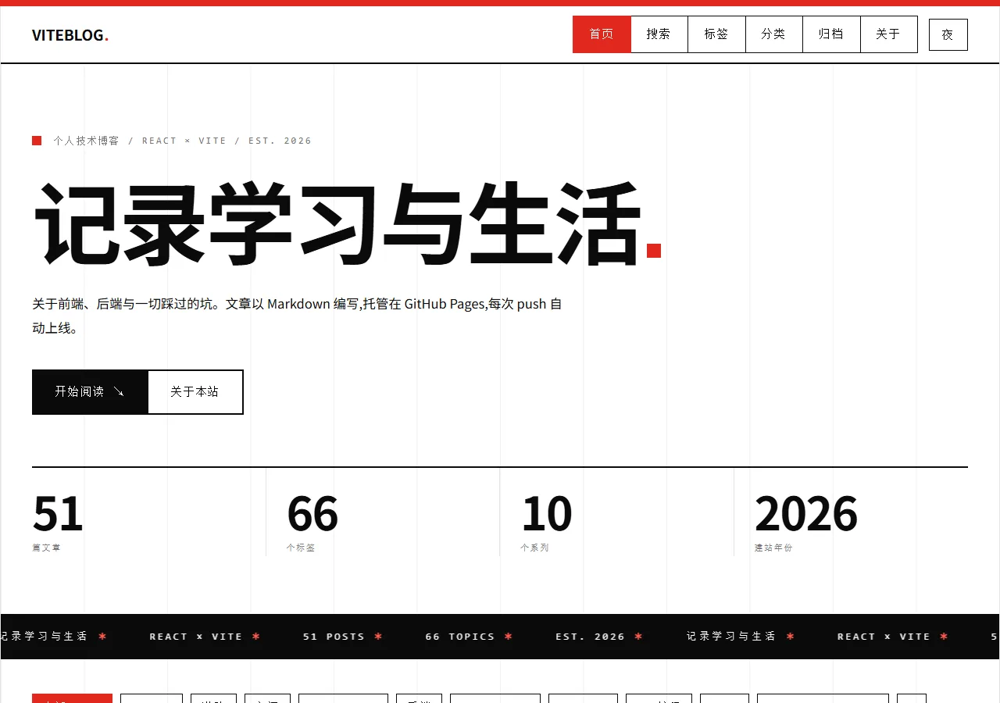
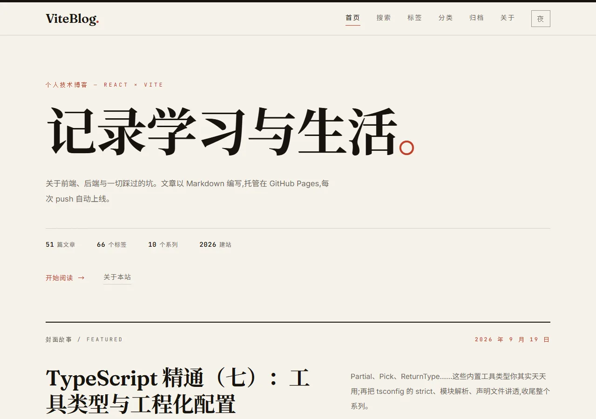
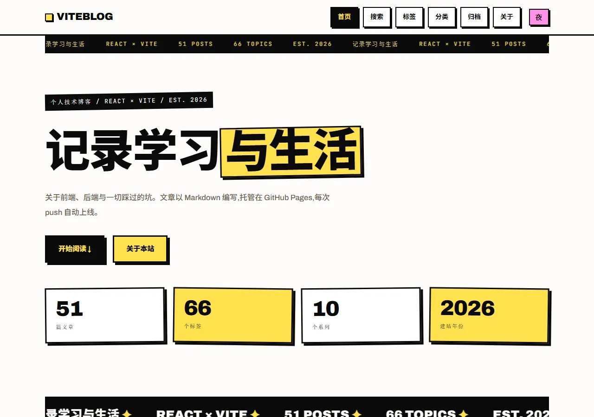
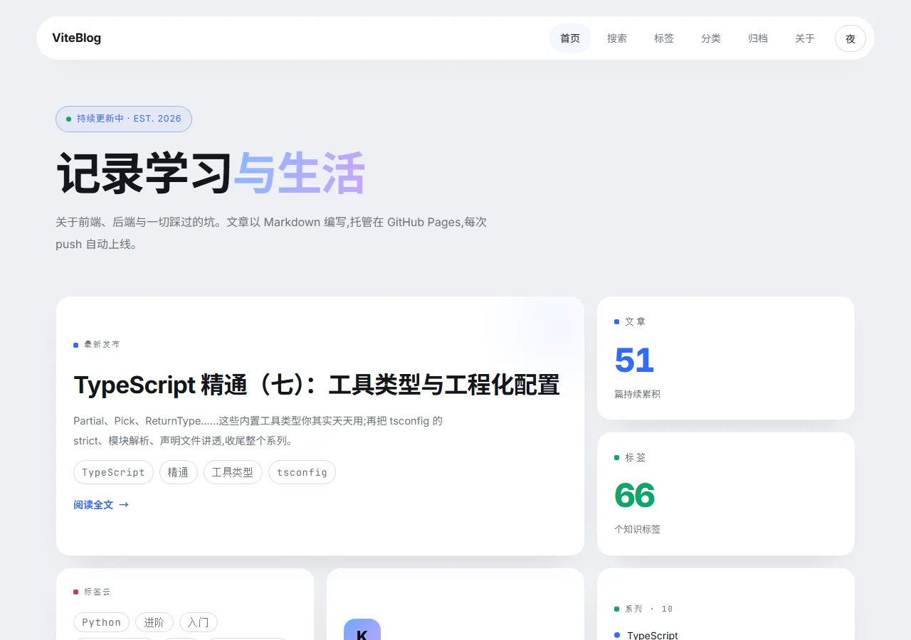
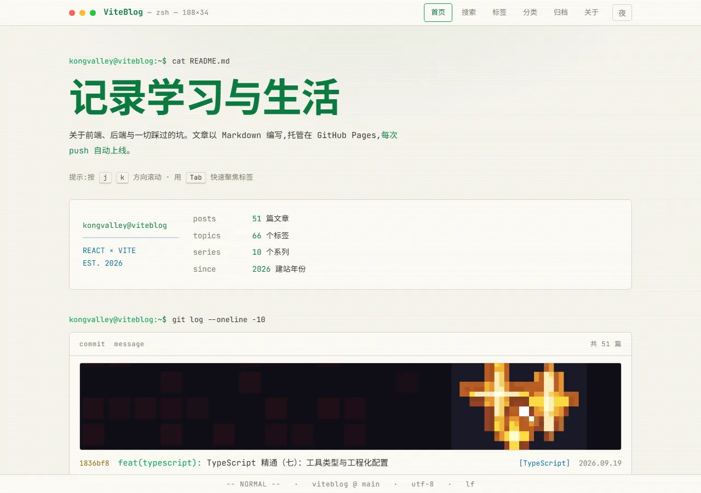
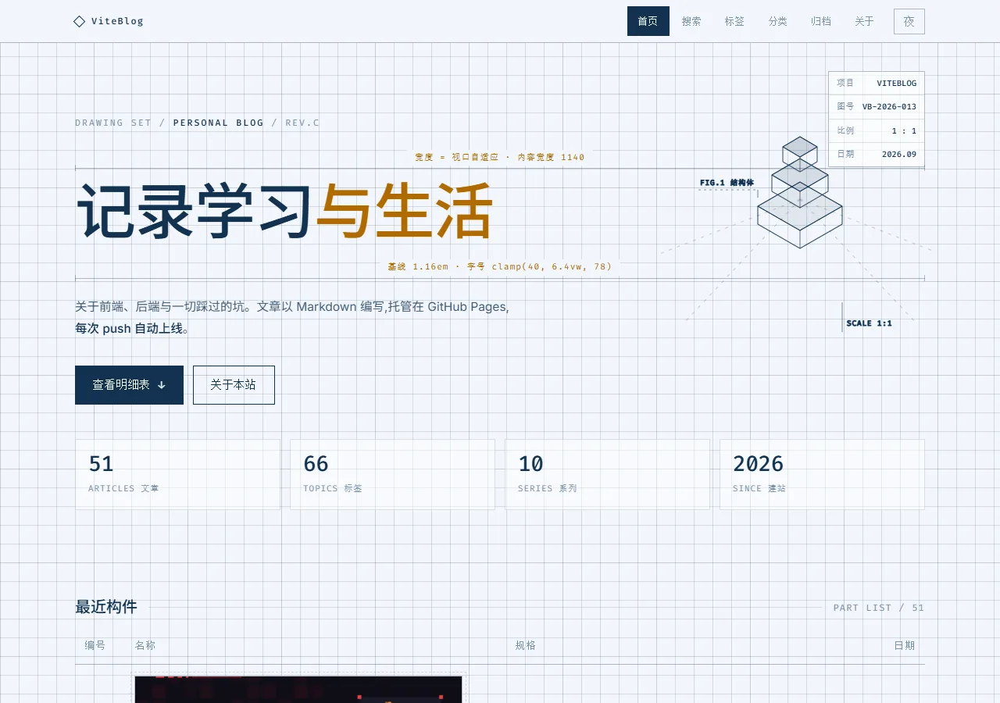

# ViteBlog

基于 **React + Vite + TypeScript 7** 的个人博客,托管在 GitHub Pages 上,通过 GitHub Actions 自动构建部署。UI 为红白机像素风。

改动记录见 [CHANGELOG.md](./CHANGELOG.md)。

## 本地开发

```bash
npm install     # 安装依赖
npm run dev     # 启动开发服务器
npm run build   # 类型检查(tsc)+ 构建生产版本到 dist/
npm run preview # 本地预览构建产物
npm run lint    # Biome 检查(格式 + lint),CI/提交前跑这个
npm run lint:fix # Biome 自动修复可安全修复的问题
npm run format  # 仅用 Biome 格式化代码
```

项目使用 **Biome** 做代码检查与格式化(配置见根目录 `biome.json`),
规则:2 空格缩进、单引号、导入自动排序;`public/` 静态资源不参与检查。
个别确有理由的告警用 `// biome-ignore lint/规则名: 原因` 行内抑制。

项目使用 **TypeScript 7**(原生 tsc):所有数据层(`src/data/*.ts`)有完整类型定义,
构建前会先跑 `tsc --noEmit` 类型检查,CI 上有类型错误会直接部署失败。

## 如何写文章

一条命令生成模板(文件名就是链接 slug,子目录用 `/` 分隔):

```bash
npm run new -- "我的新文章"                       # → src/posts/我的新文章.md
npm run new -- notes/my-post "带标点的:文章标题"    # → src/posts/notes/my-post.md,标题单独指定
```

模板已经带好 frontmatter 和骨架,写完把 `tags` / `categories` / `excerpt` 换成真实内容即可;同名文件已存在时会拒绝并提示,不会覆盖。

也可以直接手写:在 `src/posts/` 下新建一个 `.md` 文件即可,可以直接放进子目录。链接 slug 是相对 `src/posts/` 的路径(如 `notes/my-first-post.md` → `/post/notes/my-first-post`)。

```markdown
---
title: 文章标题
date: 2026-09-15        # YYYY-MM-DD,卡片上显示的发布日期
tags:
  - React
  - 随笔
categories:
  - Build Blog
excerpt: 一两句话摘要,显示在首页卡片上。
---

正文用 Markdown 编写,支持代码块、表格、引用等。

**frontmatter 字段**:`title`(必填)、`date`(必填,倒序排序依据)、`tags`、`categories`、`excerpt`(首页卡片摘要)、`cover`(可选,卡片头图 / 文章页头图 / 分享图顶部;不写就自动用构建期生成的封面 —— 见「自动封面」)。

**正文扩展语法**(都是可选,不用也不影响):

````markdown
<!-- 提示块:note / tip / warning / danger,第二段是标题(可省) -->
::: warning 注意
这里写内容,里面可以继续用 Markdown。
:::

<!-- 公式(KaTeX,按需加载,没公式就不下载) -->
行内 $E = mc^2$,整段用 $$ ... $$

<!-- 图表(Mermaid,同样按需加载) -->


<!-- 脚注 -->
一句话[^1]

[^1]: 脚注内容,会自动收进文末的脚注区。

<!-- 代码块:语言后面可以标要高亮的行 -->
```ts {2,5-7}
const hello = (name: string) => `hello, ${name}`;
```
````

代码块自带语言标签与「复制」按钮;图片自动懒加载、点击可放大;有 `title` 的图片会渲染成带图注的 `<figure>`;外链自动新窗口打开。
```

首页列表按 Markdown 元信息里的 **`date` 字段**倒序排列,日期越新的文章越靠前。

保存后无需改任何代码,首页自动出现新文章。

### 自动封面

没写 `cover` 的文章会有一张构建期生成的像素风封面,不用去找图:

- 画面 = 这篇文章在首页卡片上的那个像素图案(手绘精灵或贴纸)+ 按 slug 确定性铺开的底纹方块 + 分类名;
- 刻意不放标题和日期 —— 首页卡片、文章头图、分享图上标题都另有位置,封面上再来一遍就是重复;
- 想换掉某一篇:在 frontmatter 写 `cover: <图片地址>` 即可(手填的优先,且只有手填时 `og:image` 才用它,
  否则用带标题的 1200×630 分享卡);
- 生成物在 `public/covers/<slug>.png`(已 gitignore),`npm run dev` / `npm run build` 会自动补,
  也可以单跑 `npm run covers`;源文件比产物新才会重画,平时不会拖慢启动。

## 站点配置

所有站点信息统一在根目录的 **`site.yml`** 里修改,不用碰任何代码:

```yaml
name: ViteBlog            # 博客名称
tagline: 记录学习与生活     # 一句话简介
author: KongZhipeng       # 你的名字
since: 2026               # 建站年份
githubUser: KongValley    # GitHub 用户名(名片/头像/链接)
github: https://github.com/KongValley/ViteBlog   # 仓库地址(可省略,自动用用户名拼)
avatar: https://github.com/KongValley.png?size=60 # 头像(可省略,默认 GitHub 头像)
```

本地 `npm run dev` 时改 yml 会自动热更新;push 到 GitHub 后自动重新部署。
省略 `github` / `avatar` 字段时会根据 `githubUser` 自动生成,所以最小配置只需 5 行。

### 访问统计

站点默认**不加载任何统计脚本**。想统计就在 `site.yml` 里配一段(二选一,或都配):

```yaml
analytics:
  goatcounter: ''   # GoatCounter 站点代码(https://<代码>.goatcounter.com 里的那段),轻量、无 cookie
  umamiSrc: ''      # 自建 Umami 的脚本地址,如 https://umami.example.com/script.js
  umamiId: ''       # Umami 网站 ID
```

站点是 SPA,脚本只在首帧统计一次,路由切换时会自动补一次页面浏览。

### 音乐挂件(贴边播放器)

`site.yml` 的 `music` 段可以给站点加一个音乐挂件:Meting 接口取播放地址 + [APlayer](https://github.com/DIYgod/APlayer) 播放(npm 依赖已装好),固定在**左下角**,可以收成一张封面方块贴在屏幕边缘(状态记在 localStorage,收起后下次进站还是收起的)。

```yaml
music:
  server: tencent                 # tencent(QQ音乐)/ netease(网易云)/ kugou / kuwo / baidu
  type: song                      # song(单曲)/ playlist(歌单)
  id: 003qYzA508Z2yF              # 单曲填歌曲 id;歌单填歌单 id(纯数字直接写,不用加引号)
  api: https://api.injahow.cn/meting/?server=:server&type=:type&id=:id
```

- 三个占位符 `:server` / `:type` / `:id` 必须保留,组件会按需替换;写错会回退到默认公共实例并在控制台提示。
- **歌单**:`type: playlist` 后,播放器右下角多一个列表按钮,点开是整张歌单(默认收起,列表出现在控制条上方,不会把控制条顶走)。
- **能不能播取决于平台**:实测网易云的歌单基本都能播;QQ 音乐对大部分歌曲有会员/版权限制,代理拿不到播放地址(播放器会提示 audio error 并自动跳下一首),自选的单曲一般没问题。
- 公共实例偶尔不可用,此时挂件里显示一行失败提示(不影响页面其它部分)。想稳一点可以按 [Meting-API](https://github.com/metowolf/Meting-API) 自建后改 `api`。
- 整段删除(或留空 `id`)则不渲染挂件。
- 挂件挂在 `App` 上而不是某个页面:固定层的东西跟路由走的话,切页面音乐就断了。
- 播放器只能手动点播放(浏览器不允许自动播放),且音频地址由第三方接口提供,能否播放取决于对方服务。

## 站点功能

| 功能 | 入口 |
| --- | --- |
| 全文搜索 | 导航「搜索」或按 `/`;构建期生成 `public/search-index.json`(51 篇 / 171 KB,含正文与代码块),进搜索页才懒加载,加载失败自动退回元信息搜索;结果带命中片段与高亮。支持 `?q=` 分享链接、多词全部命中、↑↓/Enter/Esc |
| 分类 / 归档 | 导航「分类」「归档」;分类详情 `/categories/<名字>` |
| 标签总览 | 导航「标签」;可按分类过滤、按数量/名称排序、字号随热度分档 |
| 随机一篇 | `/random`(404 页也有入口) |
| 相关文章 | 文章底部按分类/标签相似度推荐 3 篇 |
| 阅读进度 / 目录 | 文章页顶部进度条;窄屏右下有悬浮目录按钮(宽屏用左侧卷轴目录) |
| 键盘快捷键 | 按 `?` 查看全部;`/` 搜索、`h/t/a/c` 跳转、`←/→` 上下篇、`b` 回顶、`Esc` 关闭 |
| 图片 | 懒加载、点击放大(灯箱);本地图构建期生成 webp 变体与 `srcset`(老文的 27 张外链图已全部本地化到 `public/images/`,不再依赖图床) |
| 封面来源 | 没写 `cover` 用构建期生成的像素封面;**想要真实照片**用 `npm run cover -- <slug> "关键词"`:从 Openverse 搜 CC0/公有领域图,裁成 1200×630 落进 `public/images/covers/`,自动写好 frontmatter(详见「封面与图片来源」) |
| 公式 / 图表 | KaTeX 与 Mermaid,按需加载(正文没用到就不下载)。实测 51 篇里 0 篇用到,依赖保留备用 —— 它们只在文章页需要的 chunk 里,不影响首屏 |
| 彩蛋 | 首页游戏机卡片上的点击粒子;输入 Konami 码(↑↑↓↓←→←→BA)有惊喜 |
| 订阅与收录 | 构建期生成 `feed.xml`、`atom.xml`、`sitemap.xml`、`robots.txt`;页脚也有 RSS / Atom / Sitemap 入口 |
| 友链页 | `/links`,数据来自 `site.yml` 的 `friends` 段(name/url 必填,avatar/desc 可省);没配时显示空态;已进 sitemap 与预渲染 |
| 文章元信息 | 日期旁显示「更新于 …」(frontmatter `updated` 与 `date` 不同天时);文末有「编辑此页 / 报个错」直达 GitHub |
| 静态页预渲染 | 非文章页(`/tags`、`/categories/…`、`/archive`、`/search`、`/about`)也生成静态 HTML,线上直接 200,不再走 SPA 404 兜底 |
| 结构化数据 | 文章页注入 `BlogPosting`、站点页注入 `WebSite` / `Person` 的 JSON-LD;所有页面 head 带 `rel=alternate` 订阅发现 |
| 分享卡片 | 每篇文章构建期预渲染静态 HTML(独立 title/description/OG)并生成 1200×630 分享图 |
| 页面内分享条 | 文章底部的「复制链接 / 微博 / X / 生成分享图」,四个按钮等宽等高(108×40,2px 描边 + 硬阴影,按下有回弹) |
| 自动封面 | 没写 `cover` 的文章,构建前自动生成一张 1200×630 的像素风封面(`scripts/build-covers.mjs`):图案就是该文在首页用的那个像素图标,底纹方块与边框按 slug 稳定生成 —— 同一篇每次都是同一张图。输出到 `public/covers/`,dev 与构建都能直接取到 |
| 分享长图 | 「生成分享图」用 canvas 现画一张海报(站点名、标题、摘录、内容概览、日期、阅读时长、标签、二维码、页脚),可直接下载或长按保存;配色跟随当前主题,二维码指向文章地址。文章有 `cover` 时封面通栏铺在标题上方,高度随封面与摘录行数自适应。二维码库按需加载(独立 23 KB chunk),不点就不下载 |

## 项目脚本

```bash
npm run new -- "文章标题"   # 新建文章模板(见「如何写文章」)
npm run images              # 扫描 public/images/,生成 webp 变体与清单(构建前会自动跑)
npm run covers              # 生成/刷新自动封面(构建前会自动跑;加 -- --force 全部重画)
npm run fonts               # 按站内用到的字符把中文像素字体裁成子集(构建前会自动跑)
npm test                    # 纯函数单测(node 内置 test runner,零额外依赖)
npm run check               # 内容体检:frontmatter / 标题层级 / 站内死链 / 图片 alt
npm run check:themes        # 主题契约:通用变量别名是否齐全 / 是否尊重 prefers-reduced-motion
npm run check:dist          # 构建产物自检:head 标签、本地资源、预渲染与图片数量
npm run smoke               # 真站点冒烟:无头 Chrome 打开首页/文章页/标签页/友链页,查渲染与控制台报错
npm run import:images       # 把正文里的远程图片抓到 public/images/ 并改写链接(带 --dry-run)
npm run cover -- <slug> "关键词"   # 给某篇文章找一张 CC0 真实照片当封面(带 --dry-run / --index / --license)
npm run build               # 类型检查 + 构建 + 生成分享图 / feed / sitemap / 预渲染 HTML
```

`dist/` 里的 `feed.xml` / `atom.xml` / `sitemap.xml` / `robots.txt` / `post/<slug>.html` / `og/*.png`
都由构建期脚本生成,不需要手动维护;文章增删后重新构建即可。

### 质量闸门

CI(deploy 之前)按顺序跑:`npm run lint` → `npm test` → `npm run check` → `npm run check:themes`,
构建后再跑主题隔离自检、`npm run check:dist` 与 `npm run smoke`(无头 Chrome 冒烟,截图作为 artifact 留档)。
本机没装 Chrome/Edge 时冒烟会自动跳过,不会误报失败。
依赖更新走 Dependabot(每周一次,npm 与 GitHub Actions 分组提交)。

### 首屏与字体

- 首页只加载「选中的那套主题首页组件」:`virtual:site-home` 在构建期注入,`src/views/Home.tsx` 不再 import 十套;
- 文章页走路由懒加载,marked + highlight.js 不进首屏(实测首屏 JS 476.7 KB → 331 KB,gzip 149.6 → 105 KB);
- 中文像素字体按「站内实际用到的字符」构建期子集化(588 KB → 47 KB,8.1%),单独成 `fonts-*.css` 异步加载;
- 构建收尾会删掉 `dist` 里永远不会被下载的 woff/ttf 老格式字体(每次约 1 MB)。

## 封面与图片来源

文章的封面有三条路,按「省事 → 讲究」排:

1. **不写 `cover`** —— 构建期自动生成一张 1200×630 的像素风封面(`scripts/build-covers.mjs`,图案取自该文在首页的图标);
2. **`npm run cover -- <slug> "关键词"`** —— 从 [Openverse](https://openverse.org) 的公开 API 搜图(免密钥),
   默认只收 **CC0 / 公有领域**,下载后裁成 1200×630 写进 `public/images/covers/`,并把 `cover:` 写进 frontmatter。
   `--dry-run` 先看候选,`--index 2` 换一张,`--license cc0,pdm,by` 放宽到需要署名的图(那样请自行在正文注明作者与许可)。
3. **自己找图** —— 丢进 `public/images/`,在 frontmatter 写 `cover: <带部署 base 的路径>`(例如 `/ViteBlog/images/covers/xxx.jpg`)。

三个来源都能用,但**一定要落在 `public/images/` 里**:

- 构建期的 webp 变体 + `srcset` + 宽高只在清单收录的本地图上生效(远程图会被跳过);
- 「生成分享图」用 canvas 现画,跨域图会把画布标脏、导不出来 —— 本地同源图没这个问题;
- 老文原来挂在阿里云 OSS 上的图已经用 `npm run import:images` 全部抓回本地。

其它免费图源(都支持下载后自托管):[Unsplash](https://unsplash.com)(免费、不强制署名)、
[Pexels](https://www.pexels.com) / [Pixabay](https://pixabay.com)(CC0 类似条款)、
[Wikimedia Commons](https://commons.wikimedia.org)(多为 CC-BY-SA,需署名)、
[unDraw](https://undraw.co) / [OpenPeeps](https://www.openpeeps.com)(开源插画风,技术文很搭),
以及 [Wallhaven](https://wallhaven.cc)(你老文里那批 `wallhaven-*.jpg` 就是它)。

## 主题

主题与共享组件之间的边界(必须定义的 CSS 变量、优先级规则、新增一套主题要改哪些文件、
以及几个踩过的坑)都写在 [docs/theme-contract.md](docs/theme-contract.md),
`npm run check:themes` 会把其中的变量与动效要求变成可执行的检查。

站点内置十套**完全独立**的主题,通过根目录 `site.yml` 里的 `theme` 字段指定(本地改完自动热更新,push 后自动重新部署):

```yaml
theme: pixel   # 十选一:pixel / swiss / editorial / brutalist / bento / terminal / glass / ma / blueprint / noir
```

| 预览 | theme | 风格 |
| --- | --- | --- |
| [](docs/themes/pixel.webp) | `pixel`(默认) | 红白机像素风:游戏机名片、像素字体、CRT 扫描线 |
| [](docs/themes/swiss.webp) | `swiss` | 瑞士网格风:强对比黑白、12 栏网格参考线、红色方点、悬浮反色 |
| [](docs/themes/editorial.webp) | `editorial` | 现代编辑排版风:衬线大标题、纸感底色、报刊式排版 |
| [](docs/themes/brutalist.webp) | `brutalist` | 新粗野主义:粗黑边框、实心偏移阴影、高饱和撞色、机械按键手感 |
| [](docs/themes/bento.webp) | `bento` | Bento 便当格:六栏卡片矩阵、特性大卡与数据小格混排 |
| [](docs/themes/terminal.webp) | `terminal` | 终端 CLI:命令提示符、git log 文章列表、neofetch 面板、vim 状态栏 |
| [](docs/themes/glass.webp) | `glass` | 玻璃拟态:渐变光斑背景、毛玻璃卡片、悬浮胶囊导航 |
| [](docs/themes/ma.webp) | `ma` | 日式极简「间」:和纸底、明朝体大标题、竖排落款、朱印、首行缩进 |
| [](docs/themes/blueprint.webp) | `blueprint` | 工程蓝图:坐标网格、尺寸标注线、等距线框插图、右下角图签栏 |
| [](docs/themes/noir.webp) | `noir` | 暗夜霓虹:纯黑底、品红霓虹描边字、招牌闪烁、点唱机式列表 |

预览图就是上面那张表(每套一张首屏截图,存在 `docs/themes/`),主题样式改动后按顺序重跑三步即可刷新:

```bash
node design-preview/build-all.mjs      # 逐主题构建到 design-preview/out/
node design-preview/serve-dist.mjs     # 起预览服务器(4191-4200)
node design-preview/readme-shots.mjs   # 截图 → docs/themes/*.webp
```

十套主题在 `src/themes/<名字>/` 下各自独立(样式 + 字体 + 入口),**构建时只会打包被选中的那一套**,
互不混装;首页结构也按主题区分(`src/views/home/` 下的十个组件,由 `src/views/Home.tsx` 按 `theme` 调度)。
每个主题的 `index.ts` 是入口,经 vite 插件以虚拟模块 `virtual:site-theme` 注入到 `src/main.tsx`。

```
src/themes/pixel/       style.css(像素字体体积小,直接静态引入)
src/themes/swiss/       style.css + fonts.ts(中文大字重,异步加载不阻塞首屏)
src/themes/editorial/   style.css + fonts.ts(同上)
src/themes/brutalist/   style.css + fonts.ts(同上)
src/themes/bento/       style.css + fonts.ts(同上)
src/themes/terminal/    style.css + fonts.ts(同上)
src/themes/glass/       style.css + fonts.ts(同上)
src/themes/ma/          style.css + fonts.ts(同上)
src/themes/blueprint/   style.css + fonts.ts(同上)
src/themes/noir/        style.css + fonts.ts(同上)
```

明暗模式十套主题都支持,右上角按钮在昼夜之间切换。想换主题时只改 `site.yml` 一行即可。

**宽屏自适应放大**:内容列宽每套主题是固定的(1000~1280px),在 2K/4K 屏上两侧会空掉一大片。所以从 1200px 起按视口宽度分档给整页加 `zoom`(等比放大,版面比例和字号关系都不变),把留白吃回去;倍率按「容器宽 × 倍率 ≤ 该档起点视口宽」定死,任何宽度都不会出现横向滚动。固定层小控件(`.back-top`、音乐挂件)挂在 `.page` 外面,不参与放大。

新增一套主题:在 `src/themes/<名字>/` 放 `index.ts`(引入 `style.css`,字体大就拆到 `fonts.ts` 里异步加载),
写一个 `src/views/home/<名字>Home.tsx`,再把名字加进 `vite.config.ts` 的 `THEMES` 和 `src/data/site.ts` 的 `THEME_NAMES`。

## 设计稿

`design-preview/` 里留有选型阶段的设计 Demo(十六套风格 + 选型总览页),仅作参考,
不参与构建;不需要时可整目录删除。本地预览:`node design-preview/serve.mjs`

同目录下还有几个只用于本地验证的小脚本(同样不参与构建):

- `serve-dist.mjs` — 每套主题的构建产物各占一个端口(4191~4200),按线上子路径 `/ViteBlog/` 提供服务
- `build-all.mjs` — 逐主题构建并把产物拷进 `design-preview/out/<theme>/`(供 `serve-dist.mjs` 使用,构建期间临时改写 `site.yml`,结束按原文恢复)
- `check-isolation.mjs` — 主题隔离自检:每套构建产物只含自己的样式,不混入其它主题
- `shoot.mjs` — 无头 Chrome 逐主题逐页面全页截图,并检查控制台有无报错
- `audit-fonts.mjs` — 交互控件字号体检 / 修正:导航、标签、分页、按钮、目录低于下限时报出来,加 `--fix` 按下限统一修正
- `shoot-url.mjs` — 给任意 URL 拍一张全页截图(本地预览或线上站点皆可),用于单页验证与线上比对
- `shoot-demos.mjs` — 给 `design-preview/` 里的选型 Demo 批量全页截图(需先跑 `serve.mjs`)

## 部署说明

- 仓库 **Settings → Pages → Source** 选择 **GitHub Actions** 后,每次 push 到 `main` 分支会自动构建并发布。
- 线上地址:`https://<用户名>.github.io/ViteBlog/`
- ⚠️ `vite.config.js` 里的 `base: '/ViteBlog/'` 必须与仓库名一致,如果仓库改名需同步修改。
